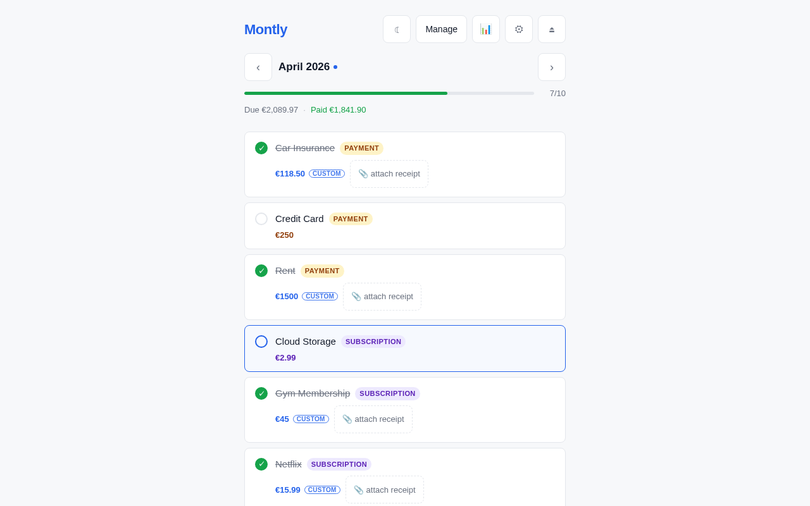
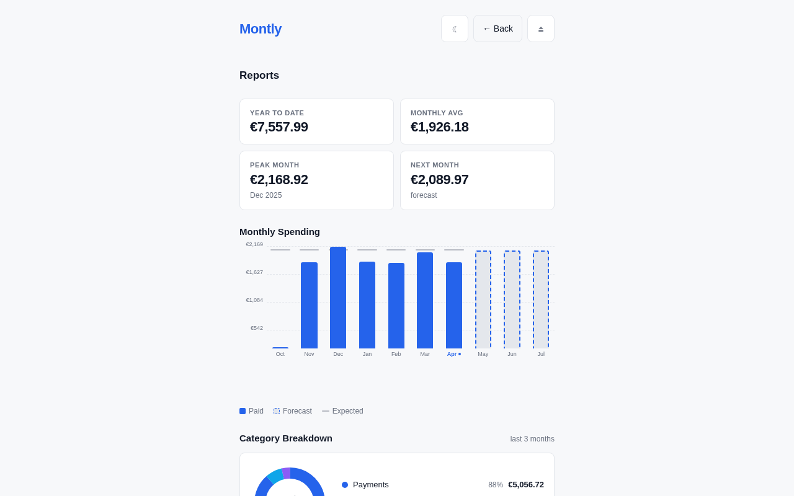

# Montly

[](LICENSE)
[](https://go.dev)
[](https://react.dev)
[](docs/deployment.md)
[](docs/deployment.md)

Self-hosted monthly recurring task tracker. Track bills, subscriptions, payments, and reminders — with receipt uploads, spending reports, multi-user support, and a clean mobile-friendly UI.

<table>
  <tr>
    <td></td>
    <td></td>
  </tr>
  <tr>
    <td align="center"><em>Task list — monthly overview with progress and amounts</em></td>
    <td align="center"><em>Reports — spending history, forecast, and category breakdown</em></td>
  </tr>
</table>

## Features

- **Recurring tasks** — monthly, bi-monthly, quarterly, semi-annual, or annual intervals
- **Task types** — payment, subscription, bill, reminder (or none)
- **Completion tracking** — mark tasks done per month, attach receipt files (PDF, image)
- **Amount logging** — record the actual amount paid per completion
- **Reports** — monthly spending bar chart with 6-month history and 3-month forecast, category donut chart, and stat cards (YTD/fiscal-year-to-date, monthly average, peak month, next forecast)
- **Webhooks** — outbound HTTP POST on task completion, uncompletion, skip, and monthly digest; testable directly from the Settings panel
- **Audit log** — append-only record of all completions, edits, deletes, user management, and token actions (admin only)
- **CSV import & export** — bulk-export all completions; import from the same format to migrate or load historical data
- **Multi-user** — isolated data per user; admin can create/delete accounts
- **First-run setup** — create the admin account through the UI on first access; no env vars needed
- **API tokens** — headless / mobile client access via `Bearer mt_…` tokens
- **Settings** — per-user currency symbol, date format, color mode (light/dark/system), task sort order, completed-task position, fiscal year start month, number format (1,234.56 or 1.234,56)
- **Two databases** — SQLite (default, zero-config) or PostgreSQL
- **Self-contained** — single Docker image, no external services required for SQLite mode

## Quick start

**Requires:** Docker with Compose v2 (`docker compose`).

```bash
git clone https://github.com/lucaslra/Montly.git
cd Montly
docker compose up -d
```

Open `http://localhost:8080` — on first access you'll be prompted to create the admin account.

> **HTTPS:** See [docs/deployment.md](docs/deployment.md) for reverse proxy setup (Caddy or nginx) and production configuration.

## Development

**Requires:** Go 1.25+, Node 18+.

Two-terminal workflow (Vite proxies `/api` to `:8080`):

```bash
make setup          # first time: go mod tidy + npm install
make dev-backend    # terminal 1 — Go API on :8080
make dev-frontend   # terminal 2 — Vite dev server on :5173
```

Run tests:

```bash
make test           # Go + frontend unit/integration tests
make e2e            # Playwright E2E tests (full stack in Docker, headless)
make e2e-headed     # Playwright E2E tests with a visible browser window
```

Or build and run the full stack via Docker:

```bash
make up
```

## Stack

| Layer    | Technology |
|----------|-----------|
| Backend  | Go 1.25, [Chi](https://github.com/go-chi/chi), [modernc/sqlite](https://gitlab.com/cznic/sqlite) (pure Go) |
| Frontend | React 19, Vite, plain CSS |
| Infra    | Multi-stage Docker, docker-compose, Makefile |

## API

All endpoints live under `/api` and `/api/v1` (both are equivalent). Authenticate with a session cookie (web UI) or an `Authorization: Bearer mt_<token>` header (API tokens).

```
POST   /api/auth/login
POST   /api/auth/logout
GET    /api/auth/setup                           — {"needs_setup": bool}, public
POST   /api/auth/setup                           — create first admin + open session
GET    /api/auth/me
PATCH  /api/auth/password

GET    /api/tasks?month=YYYY-MM
POST   /api/tasks
GET    /api/tasks/:id
PUT    /api/tasks/:id
DELETE /api/tasks/:id

GET    /api/completions?month=YYYY-MM
POST   /api/completions/toggle
PATCH  /api/completions/:task_id/:month
POST   /api/completions/:task_id/:month/receipt
DELETE /api/completions/:task_id/:month/receipt

GET    /api/settings
PUT    /api/settings

GET    /api/auth/tokens
POST   /api/auth/tokens
DELETE /api/auth/tokens/:id

GET    /api/webhooks                             — events: task.completed, task.uncompleted, task.skipped, month.digest
POST   /api/webhooks
DELETE /api/webhooks/:id
POST   /api/webhooks/:id/test

GET    /api/report?anchor=YYYY-MM

GET    /api/export/completions.csv
POST   /api/import/completions.csv

GET    /api/audit-logs                           — admin only
GET    /api/users                                — admin only
POST   /api/users                                — admin only
DELETE /api/users/:id                            — admin only
```

Every response includes `X-API-Version: 1`.

## Deployment

See **[docs/deployment.md](docs/deployment.md)** for:

- Environment variables reference
- Production docker-compose example
- Caddy / nginx reverse proxy setup
- PostgreSQL backend
- Backup procedures
- Security checklist

## Contributing

Contributions are welcome. See [CONTRIBUTING.md](CONTRIBUTING.md) for setup instructions and guidelines.

To report a security vulnerability privately, use the process described in [SECURITY.md](SECURITY.md).

This project follows the [Contributor Covenant](CODE_OF_CONDUCT.md) code of conduct.

## License

MIT — see [LICENSE](LICENSE).
